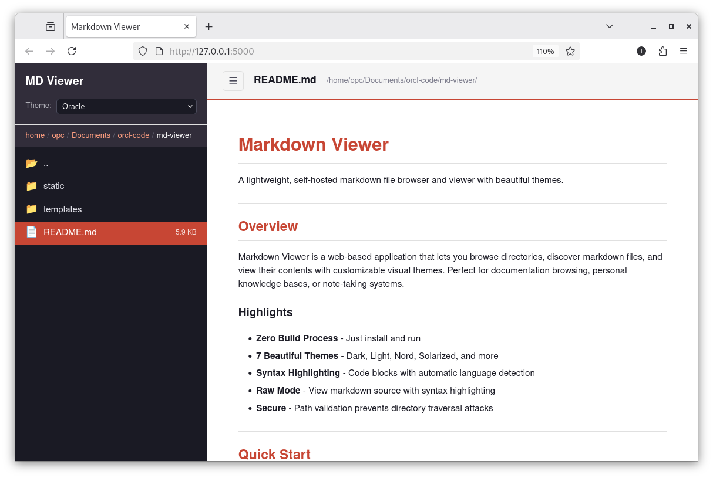

# Markdown Viewer

A lightweight, self-hosted markdown file browser and viewer with beautiful themes.



---

## Overview

Markdown Viewer is a web-based application that lets you browse directories, discover markdown files, and view their contents with customizable visual themes. Perfect for documentation browsing, personal knowledge bases, or note-taking systems.

### Highlights

- **Zero Build Process** - Just install and run
- **7 Beautiful Themes** - Dark, Light, Nord, Solarized, and more
- **Syntax Highlighting** - Code blocks with automatic language detection
- **Raw Mode** - View markdown source with syntax highlighting
- **Secure by Default** - Comprehensive security controls built-in

---

## Quick Start

```bash
# Clone the repository
git clone https://github.com/your-username/md-viewer.git
cd md-viewer

# Install dependencies
pip install -r requirements.txt

# Run the application
python app.py
```

Open your browser to **http://localhost:5000**

---

## Prerequisites

- Python 3.8 or higher
- pip (Python package manager)

---

## Installation

```bash
# Install dependencies
pip install -r requirements.txt

# Run the application
python app.py
```

---

## Configuration

The application uses environment variables with secure defaults:

| Environment Variable | Default | Description |
|---------------------|---------|-------------|
| `FLASK_DEBUG` | `False` | Enable Flask debug mode (NEVER in production) |
| `FLASK_HOST` | `127.0.0.1` | Server bind address (localhost only) |
| `FLASK_PORT` | `5000` | Server port |
| `SECRET_KEY` | Auto-generated | Session encryption key (persistent recommended) |

### Development Setup

```bash
python app.py
# Runs on http://127.0.0.1:5000 with debug disabled
```

### Production Setup

```bash
# Generate a persistent secret key
export SECRET_KEY="$(python3 -c 'import secrets; print(secrets.token_hex(32))')"

# Use production WSGI server (recommended)
pip install gunicorn
gunicorn -w 4 -b 127.0.0.1:5000 app:app

# Or use built-in server
python app.py
```

**Production Deployment with Nginx:**

```nginx
server {
    listen 80;
    server_name your-domain.com;

    location / {
        proxy_pass http://127.0.0.1:5000;
        proxy_set_header Host $host;
        proxy_set_header X-Real-IP $remote_addr;
    }
}
```

---

## Features

### File Browser

- Navigate directories from your Documents folder
- Breadcrumb navigation for quick path jumping
- Collapsible sidebar for focused reading
- Hidden file filtering (skips dotfiles)

### Markdown Rendering

- Full GitHub Flavored Markdown (GFM) support
- Automatic syntax highlighting for code blocks
- Line break preservation for better readability

### Dual View Modes

| Mode | Description |
|------|-------------|
| **Formatted** | Beautifully rendered HTML with proper styling |
| **Raw** | Markdown source with line numbers and syntax highlighting |

### Theme System

Switch between 7 carefully crafted themes:

| Theme | Description |
|-------|-------------|
| **Dark** | Sleek dark theme for eye comfort |
| **High Contrast** | Maximum readability with strong contrast |
| **Nord** | Arctic, north-bluish color palette |
| **Oracle** | Inspired by Oracle's brand colors |
| **Sepia** | Warm, book-like reading experience |
| **Solarized Light** | Ethan Schoonover's precision color scheme |
| **Raw** | For viewing raw markdown source |

Theme preferences persist across sessions using localStorage.

---

## Security Features

Markdown Viewer implements defense-in-depth security controls:

### Access Controls

- **Path Validation** - Prevents directory traversal attacks
- **Symlink Protection** - Blocks symbolic link access to prevent restriction bypass
- **Home Directory Restriction** - Cannot access files outside your home directory
- **File Type Filtering** - Only serves `.md` (markdown) files
- **Hidden File Exclusion** - Automatically skips files starting with `.`

### Application Security

- **CSRF Protection** - 64-character hex tokens validate all POST requests
- **Rate Limiting** - 100 requests per 60 seconds per client IP
- **Security Headers** - CSP, X-Frame-Options, HSTS, X-XSS-Protection
- **Input Validation** - All user inputs validated and sanitized
- **File Size Limits** - 100KB theme limit, 16MB request size limit
- **Exception Sanitization** - Generic error messages prevent information leakage

### Secure Defaults

- **Debug Mode Disabled** - Debug off by default, environment variable controlled
- **Localhost Binding** - Binds to `127.0.0.1` by default, not all interfaces
- **Session Encryption** - Secure random session keys
- **Security Logging** - All security events logged to `security.log`

### Security Best Practices

1. **Never enable debug mode in production** - Set `FLASK_DEBUG=False`
2. **Use a persistent SECRET_KEY** - Generate and save in environment
3. **Run behind a reverse proxy** - Use Nginx or Apache for TLS/HTTPS
4. **Keep dependencies updated** - Regularly update Flask and other packages
5. **Monitor security logs** - Review `security.log` for suspicious activity
6. **Use strong host binding** - Keep `FLASK_HOST=127.0.0.1` unless needed
7. **Enable HTTPS** - Always use TLS in production environments

---

## API Reference

### Endpoints

| Method | Endpoint | Description |
|--------|----------|-------------|
| `GET` | `/` | Serve the main application |
| `GET` | `/api/csrf-token` | Get CSRF token for session |
| `GET` | `/api/browse?path=<dir>` | List directory contents |
| `GET` | `/api/file?path=<file>` | Get markdown file content |
| `GET` | `/api/themes` | List available themes |
| `POST` | `/api/themes` | Create or update a theme (requires CSRF token) |

### Example: Browse Directory

```bash
curl "http://localhost:5000/api/browse?path=/home/user/Documents/notes"
```

### Example: Get File Content

```bash
curl "http://localhost:5000/api/file?path=/home/user/Documents/notes/readme.md"
```

### Example: Create Theme

```bash
# Get CSRF token
TOKEN=$(curl -s http://localhost:5000/api/csrf-token | jq -r '.csrf_token')

# Create theme
curl -X POST http://localhost:5000/api/themes \
  -H "Content-Type: application/json" \
  -H "X-CSRF-Token: $TOKEN" \
  -d '{"id":"custom","name":"My Theme","css":":root { --bg-primary: #fff; }"}'
```

---

## Project Structure

```
md-viewer/
├── app.py                          # Flask backend application
├── requirements.txt                # Python dependencies
├── README.md                       # This file
├── LICENSE                         # MIT License
├── templates/
│   └── index.html                 # Main HTML template
└── static/
    ├── js/
    │   ├── app.js                 # Frontend application logic
    │   ├── marked.min.js          # Markdown parser
    │   └── highlight.min.js       # Syntax highlighting
    └── css/
        ├── main.css               # Base styles and layout
        ├── highlight-github.min.css # Code highlighting theme
        └── themes/                # Theme CSS files
            ├── dark.css
            ├── high-contrast.css
            ├── nord.css
            ├── oracle.css
            ├── raw.css
            ├── sepia.css
            └── solarized-light.css
```

---

## Tech Stack

| Component | Technology |
|-----------|------------|
| Backend | Python 3 + Flask 3.0.0 |
| Frontend | Vanilla JavaScript (ES6+) |
| Markdown Parser | Marked.js v15 |
| Syntax Highlighting | Highlight.js v11.9.0 |
| Styling | CSS3 with CSS Variables |

---

## Creating Custom Themes

Add a new CSS file to `static/css/themes/` with this format:

```css
/*
My Custom Theme
A description of your theme
*/

:root {
    --bg-primary: #ffffff;
    --bg-secondary: #f5f5f5;
    --sidebar-bg: #fafafa;
    --text-primary: #333333;
    --text-secondary: #666666;
    --text-muted: #999999;
    --border-color: #e0e0e0;
    --accent-color: #007bff;
    --code-bg: #f4f4f4;
    --link-color: #0066cc;
}
```

The theme will automatically appear in the theme selector after server restart.

---

## Browser Support

- Chrome (latest)
- Firefox (latest)
- Safari (latest)
- Edge (latest)

Requires JavaScript enabled and LocalStorage support.

---

## Troubleshooting

### Application won't start

```bash
# Check Python version (3.8+ required)
python3 --version

# Reinstall dependencies
pip install -r requirements.txt --force-reinstall
```

### Port already in use

```bash
# Use different port
export FLASK_PORT=5001
python app.py
```

### Files not showing up

- Ensure files have `.md` extension
- Check file permissions
- Verify files are in your home directory
- Check `security.log` for access denied messages

### Rate limit errors

Wait 60 seconds or restart the application to reset rate limits.

---

## Contributing

Contributions are welcome! Please feel free to submit a Pull Request.

1. Fork the repository
2. Create your feature branch (`git checkout -b feature/amazing-feature`)
3. Commit your changes (`git commit -m 'Add amazing feature'`)
4. Push to the branch (`git push origin feature/amazing-feature`)
5. Open a Pull Request

---

## License

This project is open source and available under the [MIT License](LICENSE).

---

## Changelog

### Version 2.0 (Current)
- Added comprehensive security controls (CSRF, rate limiting, security headers)
- Implemented symlink protection and path validation
- Added security logging and audit trail
- Removed external CDN dependencies (self-hosted libraries)
- Enhanced error handling and exception sanitization
- Added environment variable configuration
- Secure defaults (debug off, localhost binding)

### Version 1.0
- Initial release
- Basic markdown viewing functionality
- Theme system with 7 themes
- File browser with directory navigation

---

<p align="center">
  Made with Python and vanilla JavaScript
</p>
