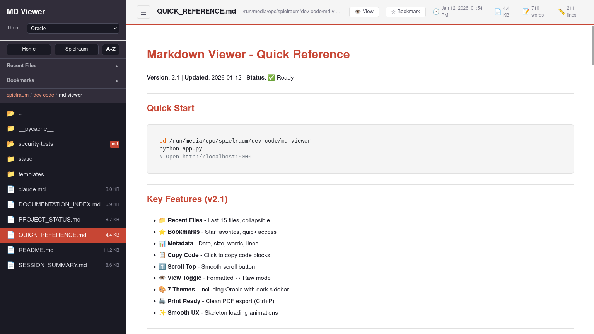

# Markdown Viewer

A lightweight, self-hosted markdown file browser and viewer with beautiful themes.



## Quick Start

Requires Python 3.8+.

```bash
git clone https://github.com/your-username/md-viewer.git
cd md-viewer
python3 -m venv venv && ./venv/bin/pip install -r requirements.txt
PYTHON=./venv/bin/python ./start.sh
```

Open **http://localhost:5000**

`start.sh` honors `FLASK_HOST` (default `127.0.0.1`), `FLASK_PORT` (default `5000`), `PYTHON`, and `SECRET_KEY`. Set `SECRET_KEY` to keep sessions across restarts. The 🏠 button follows the user running the process; 📁 jumps to the configured Spielraum directory.

## Features

- **File Browser** - Navigate directories with breadcrumb navigation and collapsible sidebar
- **Markdown Rendering** - GitHub Flavored Markdown with syntax-highlighted code blocks
- **6 Themes** - Dark, Nord, Oracle, Sepia, Solarized Light, and Raw (source view)
- **Recent Files** - Tracks last 8 opened files
- **Bookmarks** - Star files for quick access
- **File Metadata** - Modified date, size, word count, line count
- **Copy Code** - One-click copy on all code blocks
- **Print Ready** - Clean output via Ctrl+P
- **Secure by Default** - CSRF protection, rate limiting, path validation, DOMPurify sanitization

## Project Structure

```
md-viewer/
├── app.py                       # Flask backend
├── start.sh                     # Launcher (banner + env overrides)
├── requirements.txt             # Python dependencies (Flask)
├── templates/
│   └── index.html               # Single-page HTML shell
└── static/
    ├── js/
    │   ├── app.js               # Frontend application logic
    │   ├── marked.min.js        # Markdown parser
    │   ├── highlight.min.js     # Syntax highlighting
    │   └── purify.min.js        # XSS sanitizer (DOMPurify)
    └── css/
        ├── main.css             # Base styles and layout
        └── themes/              # Theme CSS files
```

## Tech Stack

- **Backend**: Python 3 + Flask
- **Frontend**: Vanilla JavaScript (ES6+), no build step
- **Libraries**: Marked.js, Highlight.js, DOMPurify (all self-hosted)

## Custom Themes

Add a CSS file to `static/css/themes/` with `:root` variable overrides:

```css
/*
My Theme
A short description
*/
:root {
    --bg-primary: #ffffff;
    --bg-secondary: #f5f5f5;
    --bg-sidebar: #fafafa;
    --text-primary: #333333;
    --text-secondary: #666666;
    --border-color: #e0e0e0;
    --accent-color: #007bff;
    --code-bg: #f4f4f4;
    --link-color: #0066cc;
}
```

The theme appears in the dropdown after server restart.

## API Reference

| Method | Endpoint | Description |
|--------|----------|-------------|
| `GET` | `/api/csrf-token` | Get CSRF token for session |
| `GET` | `/api/browse?path=<dir>` | List directory contents |
| `GET` | `/api/file?path=<file>` | Get markdown file content |
| `GET` | `/api/file-metadata?path=<file>` | Get file stats (mtime, size, word/line count) |
| `GET` | `/api/file-mtime?path=<file>` | Get modification time only (stat-only check) |
| `GET` | `/api/image?path=` | Serve image files |
| `GET` | `/api/themes` | List available themes |
| `POST` | `/api/themes` | Create or update a theme (requires CSRF token) |

### Examples

```bash
# Browse a directory
curl "http://localhost:5000/api/browse?path=/home/user/Documents/notes"

# Get file content
curl "http://localhost:5000/api/file?path=/home/user/Documents/notes/readme.md"

# Create a custom theme (CSRF-protected)
TOKEN=$(curl -s http://localhost:5000/api/csrf-token | jq -r '.csrf_token')
curl -X POST http://localhost:5000/api/themes \
  -H "Content-Type: application/json" \
  -H "X-CSRF-Token: $TOKEN" \
  -d '{"id":"custom","name":"My Theme","css":":root { --bg-primary: #fff; }"}'
```

All endpoints are rate-limited to 100 requests per 60 seconds per IP.

## License

[MIT](LICENSE)
